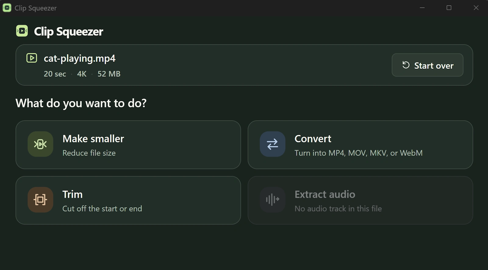

# Clip Squeezer

**Four simple video tools. Free. Fast. On your device.**

Make videos smaller, convert formats, trim the start or end, or extract the audio — without uploading your files or opening a full video editor.

Available for **Windows** and **macOS**. Free and open source.

> **Download Clip Squeezer:** [Latest release](https://github.com/rjk/clip-squeezer/releases/latest)

  

---

## Four simple tools

- **Compress** — Bring large video files down to size for sharing, with simple quality presets: **Best quality**, **Balanced**, and **Smallest file**.
- **Convert** — Switch between MP4, MOV, MKV, and WebM easily.
- **Trim** — Clip off the start and/or end of your video.
- **Extract audio** — Save the sound or voice track, keeping original quality or compressing if you need it.

---

## Why Clip Squeezer?

- **100% local & private** — Everything is processed on your computer. Your media is never uploaded.
- **No telemetry or tracking** — No advertising. No analytics. No background data collection.
- **Safe by default** — Your original video is never overwritten. Outputs are always saved as new files.
- **Simple** — Pick a tool, choose your file, and get your result. Under the hood it uses the best video and sound processing, retaining high quality and lossless where possible.
- **Open source** — The application and its build process can be inspected on GitHub.

---

## Privacy

Clip Squeezer processes media locally and does not transmit your files or usage information to external systems.

See the [Privacy Policy](docs/privacy.md) for details.

---

## Code signing policy

Official Windows releases are code signed to help users verify their origin and integrity.

**Free code signing provided by SignPath.io, certificate by SignPath Foundation.**

See the [Code signing policy](docs/code-signing.md) for the release, approval, and signing process.

---

## Installing and uninstalling

Download the latest release from the [GitHub Releases page](https://github.com/rjk/clip-squeezer/releases/latest).

### Uninstalling

**Windows:** Open **Settings → Apps → Installed apps**, find **Clip Squeezer**, and choose **Uninstall**.

**macOS:** Quit Clip Squeezer and move the application from the **Applications** folder to the Trash.

---

## Documentation & project guides

- **[Development Setup](docs/DEVELOPMENT.md)** 
- **[Architecture & Engine](docs/ARCHITECTURE.md)** 
- **[Branding & Design](docs/BRANDING.md)** 
- **[Release Process](docs/RELEASING.md)**

---

## Licensing

Clip Squeezer is free and open-source software licensed under the **GNU General Public License v3.0 or later (`GPL-3.0-or-later`)**.

You are free to use, study, modify and redistribute Clip Squeezer under the terms of the GPL.

See [LICENSE](LICENSE) for the full licence.

Copyright © Rory Kingan.

Clip Squeezer bundles third-party open-source components, including FFmpeg and FFprobe. These components remain subject to their respective upstream licences.

See [Third-party licences](docs/third-party-licenses/) for details.
